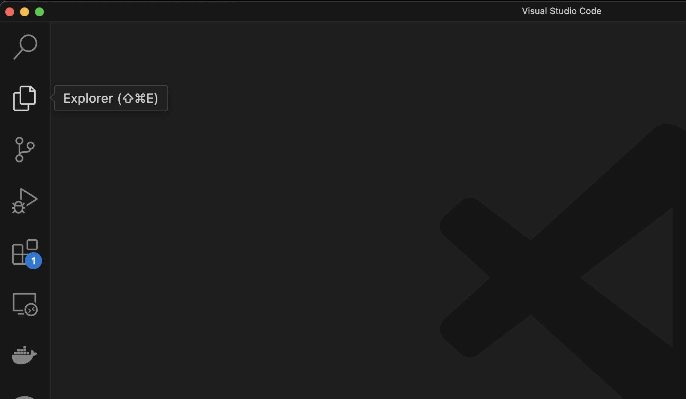
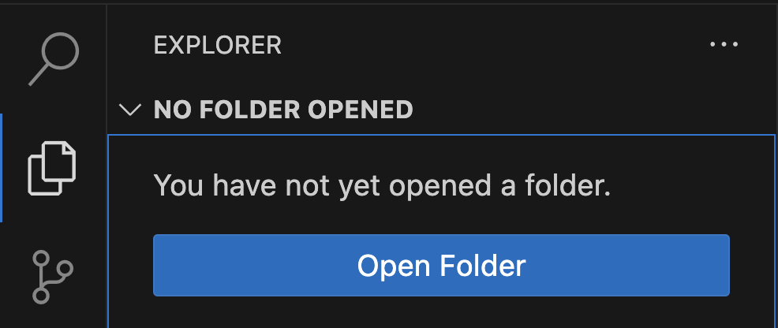
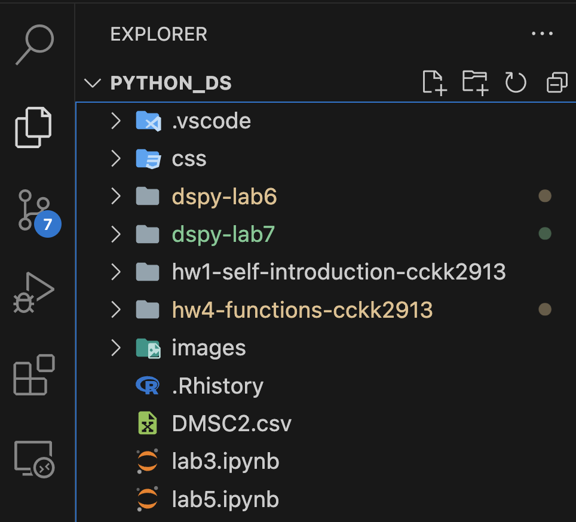
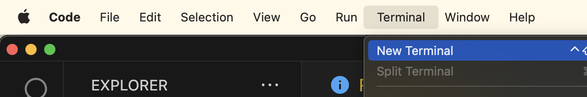
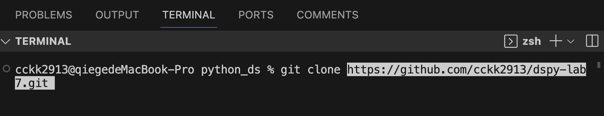
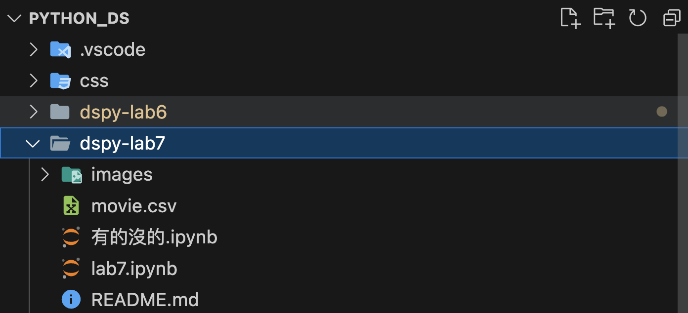
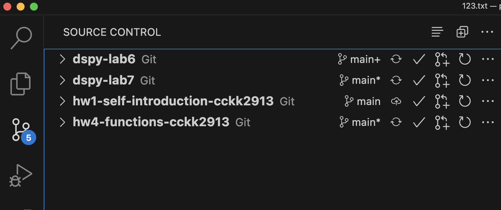

# 請務必按照步驟來 clone 資料夾

1. 先打開 VScode，最上面菜單欄 File 點選 `New Window`
2. 在新打開的這個 Window，左邊點選第二個：`Explorer` （如圖）

   

3. 點選 Explorer 後，點選 `Open Folder`（如圖）

   
  
4. 打開電腦中「這堂課專屬的資料夾」，最大的那個，裡面可能有你曾經 clone 的作業 repo、上課資料 etc.

   - 如圖，我的這堂課專屬資料夾是 `PYTHON_DS`，底下有很多小資料夾是之前clone的repo： `hw1, hw4, dspy-lab6`...

     

5. 確定打開 ❗️**這堂課專屬資料夾**❗️（不是某次作業的folder、不是上週上課的folder），再到最頂端菜單欄點選 `Terminal` >> `New Terminal`

   

6. 再到右下角，確認 % 前面的是這堂課專屬資料夾的名字（如圖，我的是 `python_ds`）。在剛剛打開的這個新 Terminal，輸入指令（可以複製下方的指令）

    

  ```bash
      git clone https://github.com/cckk2913/dspy-lab7.git
  ```

1. 確認**這堂課專屬資料夾**之下，多出一個 `dspy-lab7` 的資料夾，裡面有 `README.md`、`lab7.ipynb`、`movie.csv`、`有的沒的.ipynb` 四個檔案 ＋ `images` 一個資料夾
   
   

2. 做完一些改動之後，若點選左側欄第三個 Source Control，會看到**這堂課專屬資料夾**之下，有哪些資料夾是 cloned repo，能夠再 git push 回去 GitHub

   - 如圖，我的這堂課專屬資料夾底下有 4個是之前clone的repo

    

3.  如果你改動 `dspy-lab6、dspy-lab7` 裡面的檔案，這裡也會顯示；但如果你嘗試 commit 和 synchronize `dspy-lab6、dspy-lab7`裡面的 changes ，就會失敗，🏮🏮`因為這兩個資料夾是助教的repo，你沒有權限可以 push`🏮🏮
